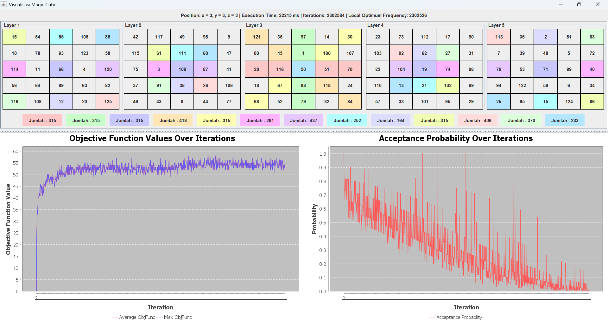

# Magic Cube Solver

> Program untuk menyelesaikan permasalahan Magic Cube 5 x 5 x 5 dan menyelesaikannya dengan menggunakan algoritma Hill Climbing With Side Moves, Simulated Annealing, dan Genetic Algorihtms.



## Tech Stack

- **Language**: Java
- **Build & Manager Tools**: Maven
- **GUI**: Java Swing
- **Chart**: jfreechart
- **JSON**: Jackson

## Installation

Clone Repository ini dengan dengan perintah berikut

```bash
  git clone https://github.com/TazakiN/Tubes1-AI.git
```

Kemudian, pastikan [maven](https://maven.apache.org/install.html) sudah terinstall.

## Usage

1. Masuk ke folder magic-cube-solver dengan perintah berikut:

    ```bash
    cd src/magic-cube-solver
    ```

2. Compile / buat Package dari program dengan perintah berikut

    ```bash
    mvn clean install package
    ```

3. Jalankan program dengan perintah berikut

    ```bash
    java -jar .\target\magic-cube-solver-1.0-SNAPSHOT-shaded.jar com.tubesai
    ```

## Features

Program ini memiliki beberapa fitur penting, diantaranya

- Menyelesaikan Magic Cube dengan algoritma Hill Climbing with Side Moves
- Menyelesaikan Magic Cube dengan algoritma Simulated Annealing
- Menyelesaikan Magic Cube dengan algoritma Genetic Algorithm
- Menampilkan Kurva Objective Function terhadap Iterasi
- Menampilkan Kurva AcceptedProbability terhadap Iterasi
- Membuat State awal Magic Cube secara random
- Membuat State awal Magic Cube dari sebuah JSON file

## Authors and Task Distribution

Kelompok 11:

- 13522015 / Yusuf Ardian Sandi (MagicCube Class, Algoritma Simulated Annealing, Main Class, Menu Class)
- 13522018 / Ibrahim Ihsan Rasyid (GeneticAlgorithm Class)
- 13522031 / Zaki Yudhistira Candra (HillClimbing Class)
- 13522032 / Tazkia Nizami (Magic Cube Visualization, Graph Data)
 
